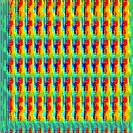

# Fooling Facial Recognition Models Using Deep Convelutional Generative Advasarial Networks

Brandon Trahms - Github: brtrahms

## Intro
Facial Recognition software is becoming more and more prevelant in our daily lives from our phones to law enforcment. To help prevent the misuse of these softwares we should further our understanding of these algorithms so they don't remain as simple black boxs in which we don't know what is inside. This project is aiming to study low barrier to entry pre-trained Facial Recognition models and their accuarcy using a Deep Convelutional Generative Advasarial Network or DCGAN. The DCGAN will be used to generate images, learning over time to generate images that are thought to have a person's face by the network. We can then look through these positive results and determine how accurate these images are compared to a human observer.

### Language:
- python

### Dependencies
- tensorflow
- keras
- keras_vggface
- matplotlib
- numpy

### Facial Recognition Models:
- keras_vggface - ResNet50
- keras_vggface - SENet50

## Experiment Description
The Facial Detection Models will be loaded in and set up in our python enviornment. Our DCGAN will be then built using Tensorflow following the basic architecture of taking in a randomized normal seed and outputing a resulting image. These outputed images will be scored on the confidence percentage given by the recognition model for a certain identity we choose and fed back to the DCGAN for optimization. Once the GAN has generated a number of detections past a certain confidence threshold, we can look through and see if there are any false positives.

For my traininngs I chose 4 identities from VGGFace2 to use which are Channing Tatum, Dwayne Johnson, Simon Cowell, and Whoopi Goldberg.

### Hardware

GPU: NIVIDIA GeForce GTX 1660 Ti with Max-Q Design

## Results

### Control Images

How confident is each model that the control images are their correct identity.

| Control Image | ResNet50 | SENet50 |
|----------|----------|---------|
| Channing Tatum | 99.325% | 99.984% |
| Dwayne Johnson | 99.926% | 99.957%
| Simon Cowell | 98.255% | 99.227% |
| Whoopi Goldberg | 98.002% | 99.568% |

### ResNet50

How confident is ResNet50 that each auto generated image is their corresponding identity.

| Target Identity | Image | Confidence |
| ----- | ----- | ------ |
| Channing Tatum |  | 99.810% |
| Dwayne Johnson |  |  99.967% |
| Simon Cowell | | 99.997% |
| Whoopi Goldberg |  | 99.394% |

### SENet50

How confident is SENet50 that each auto generated image is their corresponding identity.

| Target Identity | Image | Confidence |
| ----- | ----- | ------ |
| Channing Tatum |  | 99.256% |
| Dwayne Johnson |  | 99.999% |
| Simon Cowell | | 99.970% |
| Whoopi Goldberg |  | 99.999% |

## References

DCGAN:
 - https://www.tensorflow.org/tutorials/generative/dcgan

VGGFace2 Models:
 - https://github.com/rcmalli/keras-vggface#projects--blog-posts
 - https://www.robots.ox.ac.uk/~vgg/publications/2018/Cao18/cao18.pdf
 - https://machinelearningmastery.com/how-to-perform-face-recognition-with-vggface2-convolutional-neural-network-in-keras/
 - https://paperswithcode.com/dataset/vggface2-1
